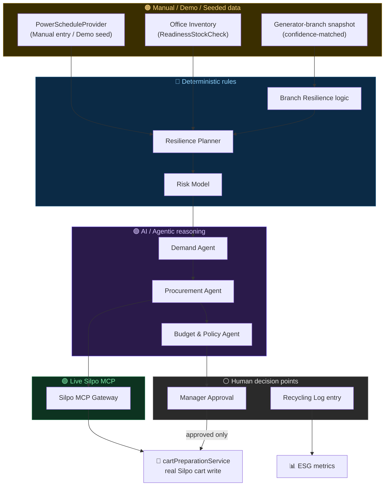
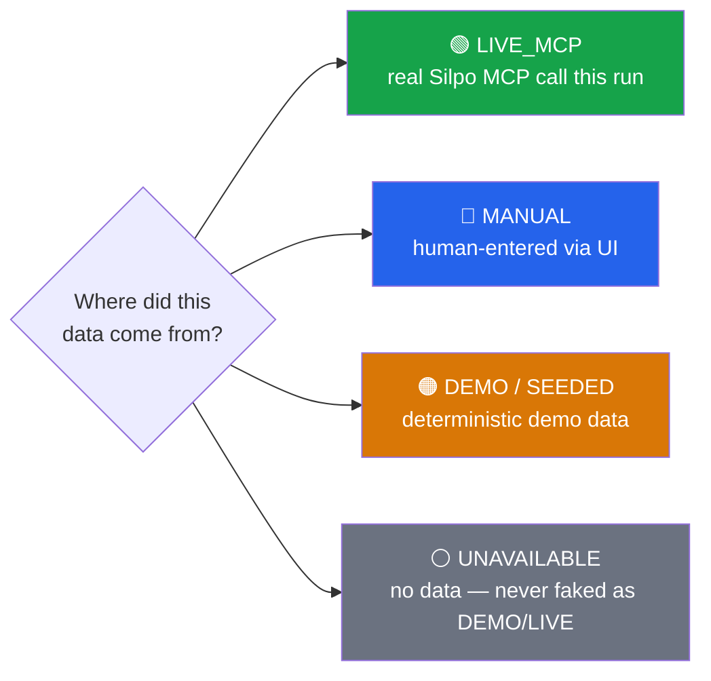

# 🛒 Silpo B2B AI Procurement & Resilience

⚡ **AI-powered B2B procurement and office-resilience layer built on top of Silpo MCP.**

Three deterministic agents run a Ukrainian office's recurring supply order against Silpo's real product catalog — and a Resilience Planner turns power-outage risk into a concrete, human-approved procurement plan, with a closed battery-recycling loop on top.

> 🔒 This is a private hackathon submission repository. See [`docs/hackathon/`](docs/hackathon/) for the full presentation kit.

---

## 🎯 Problem

Ukrainian offices already run recurring procurement — water, coffee, supplies. On top of that, routine power interruptions caused by attacks on energy infrastructure add a second layer of risk: missing emergency stock, deliveries that can't reach a working branch, no clean way to plan *before* the outage instead of scrambling *during* it.

## 💡 Solution

**Silpo B2B** connects three deterministic AI agents, a real Silpo MCP catalog integration, and a resilience-planning layer into one workflow:

- **Demand Agent** — forecasts weekly consumption from real history + feedback
- **Procurement Agent** — resolves demand to real Silpo products via live catalog search
- **Budget & Policy Agent** — optimizes for budget with promo-swaps and category caps
- **Resilience Planner** — composes power status + emergency stock + risk + delivery-branch logistics + ESG into one explainable plan

A human office manager approves every real purchase — always.

## ⚡ Blackout Resilience

The Resilience Planner turns "power situation" into "what to buy, when, and from where":

```mermaid
flowchart LR
    A["⚡ Power situation<br/>(schedule / blackout status)"] --> B["🧭 Resilience Planner"]
    B --> C["📉 Emergency stock gap<br/>(target vs. current)"]
    C --> D["🛒 Procurement Agent"]
    D --> E["🔌 Silpo MCP<br/>real catalog search"]
    E --> F["💰 Budget & Policy Agent"]
    F --> G["🚚 Delivery / logistics<br/>recommendation"]
    G --> H["🙋 Manager approval"]
    H --> I["🧺 Prepared Silpo basket<br/>(checkout stays human-controlled)"]
    I --> J["♻️ Recycling / ESG log"]

    style A fill:#7c5cff,color:#fff,stroke:#5a3fd6
    style B fill:#22d3ee,color:#06202b,stroke:#0e8ba3
    style E fill:#16a34a,color:#fff,stroke:#0f7a34
    style H fill:#f59e0b,color:#3a2600,stroke:#b97200
    style J fill:#10b981,color:#fff,stroke:#0b7a56
```



Risk is classified deterministically — `NORMAL → WATCH → PREPARE → HIGH → ACTIVE_BLACKOUT → UNKNOWN` — with plain-language reasons attached, not an opaque generated sentence. No prediction of *when* an outage will happen — this is operational planning on top of known/entered data, not attack forecasting.

## 🤖 AI / Agent Workflow

Real decision-making, no LLM chat loop:

| Agent | Decides |
|---|---|
| Demand Agent | How much of each item the office will need next cycle |
| Procurement Agent | Which real Silpo product/SKU fulfils each need |
| Budget & Policy Agent | How to fit the basket inside the weekly budget |

The Resilience Planner and its risk model are **deterministic composition logic**, not a 4th/5th agent — see [`docs/b2b-mvp/AGENTS.md`](docs/b2b-mvp/AGENTS.md).

## 🔌 Silpo MCP

Every product, price, and delivery-branch decision resolves through the real Silpo MCP server (`silpo_find_products_batch`, `silpo_get_available_delivery_types`, `silpo_get_time_slots`, `silpo_add_or_update_cart_products`) — audited across all 40 exposed tools before anything was built ([`docs/silpo-mcp-audit/`](docs/silpo-mcp-audit/)).

- ✅ **Silpo catalog/product/delivery data is genuinely live** when running `SILPO_MODE=live`, authenticated via an app-owned OAuth 2.1 + PKCE client — independently re-verified during hardening ([`docs/b2b-resilience/LIVE_MCP_VERIFICATION.md`](docs/b2b-resilience/LIVE_MCP_VERIFICATION.md)).
- ⚠️ The deterministic resilience **demo scenarios use DEMO/MOCK power data** for presentation reliability — never labeled as live.
- ⛔ **No checkout/payment/order-placement tool exists** in the audited Silpo MCP. None was built or faked. Checkout stays a manual, human step.

## 📊 Verified Demo Metrics

Captured live from the running app on Scenario A (`office-kyiv-hq`, scheduled outage tomorrow 14:00–18:00 Kyiv time), `SILPO_MODE=mock`:

| Metric | Value |
|---|---|
| Emergency-stock coverage | **21%** |
| Categories below target | **5 / 5** |
| Procurement lead time | **≈19h** |
| Delivery window shift | **4h earlier** |
| Readiness-topup proposal | **₴3,402.80 / ₴3,500** weekly budget |

These are **deterministic demo-scenario metrics** computed from real tracked stock/budget data at the moment of capture — not national-impact or societal statistics. Lead time drifts with the clock; re-check the Resilience tab's Impact Summary card for the current value before presenting. No CO₂, "outages prevented," or "businesses saved" figures are computed anywhere — see [`docs/b2b-resilience/DEMO_SCENARIOS.md`](docs/b2b-resilience/DEMO_SCENARIOS.md#demo-metrics-impact-summary-card-on-the-resilience-screen).

## 🚚 Resilient Logistics

A manually-refreshed snapshot of Silpo's real generator-backed branches ([`silpo.ua/de-pracyuiemo-na-generatorax`](https://silpo.ua/de-pracyuiemo-na-generatorax)) was matched against a live `silpo_list_branches` fetch with explicit confidence levels:

**19 EXACT · 2 HIGH_CONFIDENCE · 1 AMBIGUOUS · 0 UNMATCHED**

Only `EXACT`/`HIGH_CONFIDENCE` matches can ever trigger a branch reroute — an `AMBIGUOUS` match is reported to the manager for transparency but never acted on. Enforced in code (`src/silpo/branchFailover.js`), not just documented.

## ♻️ ESG / Battery Recycling

Ties into Silpo's real **«Батарейки, здавайтеся!»** program (247 stores, ≤50 batteries/visit, a European recycling partner, a dedicated phone line for office-scale collection). The app tracks a manual recycling log — real counts only (total recycled, drop-off history), no derived "collection rate" (no consumption tracking exists to make that honest) and no fabricated environmental-impact numbers.

## 🏗 Architecture



Full detail: [`docs/b2b-resilience/ARCHITECTURE.md`](docs/b2b-resilience/ARCHITECTURE.md) · [`docs/hackathon/ARCHITECTURE_DIAGRAM.md`](docs/hackathon/ARCHITECTURE_DIAGRAM.md)

## 🔎 Data Provenance

Every plan the app produces labels its own data sources honestly — never a hardcoded "LIVE":



A "no schedule seeded" state resolves to `UNAVAILABLE`, never quietly to `DEMO` — a real bug we found and fixed during hardening, not a hypothetical.

## 🛡 Human Approval & Safety

- `cartPreparationService` is the **only** code path allowed to write to a real Silpo cart, hard-gated in code on `proposal.status === 'approved'` — verified by automated tests, not just UI convention.
- No checkout/payment/order-placement tool exists in the audited Silpo MCP — none was built or faked.
- Branch rerouting only ever acts on a confidence-confirmed match, never an ambiguous one.
- For DTEK/outage-schedule data specifically: **no documented and verifiable official public programmatic API for outage schedules was found during our research.** Power-schedule data is either manually entered by an office manager or demo-seeded for presentation — always labeled as such.
- The AI does **not** predict attacks or outages — it reasons over known/entered schedule data only.

## 🖥️ Demo Office Portal

A second, deliberately small web surface — `public/portal/` — that represents
one seeded customer, **DreamGift Atelier** (~40 employees), and gives a
judge a single obvious interactive flow instead of requiring API calls or
terminal commands.

It is **not** a second SaaS or a second backend: the portal is a static page
that talks to our existing application API (`/api/...`) over normal
GET/POST/PUT, and that API is the only thing that ever calls Silpo MCP.
The portal never calls MCP directly and never pretends to.

```
Demo Office Portal (public/portal/)
        │  GET/POST/PUT /api/offices/:id/...
        ▼
Our Express app (src/routes/api.js)
        │  MCP tool calls (silpo_find_products_batch, etc.)
        ▼
Silpo MCP server (mcp.silpo.ua)
```

**Exact demo steps** (`http://localhost:3000/portal/`, or the deployed URL below):

1. Open the portal — DreamGift Atelier's profile loads: 40 employees, weekly
   budget, current readiness stock gaps, and the manually-entered power
   window (never a fake `LIVE` schedule — see [Data Provenance](#-data-provenance)).
2. Edit expected attendance or weekly budget and save — writes through
   `PUT /api/offices/:id` and `PUT /api/offices/:id/budget`.
3. Optionally add a consumption feedback entry (e.g. "coffee — not enough").
4. Click **▶ Run AI Procurement Plan**. A compact activity timeline appears
   live, one step per component — this is what makes the agentic workflow
   visible instead of implicit:
   - 🟣 **Demand Agent** — analysed consumption + attendance + feedback
   - 🟣 **Procurement Agent** — searched Silpo through MCP
   - 🟣 **Budget & Policy Agent** — optimised the proposal to fit budget
   - 🔵 **Resilience Planner** — folded in power status + readiness risk
   - ⚪ **Human** — approval required before anything touches a real cart
5. Review the resulting proposal (real/mock Silpo products, prices, budget
   check), the resilience recommendation, and a short plain-language
   explanation of what changed and why (Gemini Flash if `GEMINI_API_KEY`
   is set, an equally factual deterministic template otherwise — see below).
6. Click **✅ Затвердити план** — approves the proposal, then prepares a
   real Silpo cart via `cartPreparationService` (gated in code on
   `status === 'approved'`). **Checkout is never triggered** — there is no
   such tool in the audited Silpo MCP server to begin with.

**Optional Gemini Flash integration** (`src/services/explainService.js`):
used only to *phrase* already-computed facts (forecast changes, budget
trims) more naturally — never to compute quantities, prices, or budget
decisions, which stay deterministic and testable regardless of whether an
LLM is available. If `GEMINI_API_KEY` is absent or the call fails, the
portal shows a deterministic explanation built from the same facts and
labels itself `deterministic`, never a faked `gemini-flash` result.

## 🚢 Deployment

The app is designed to run as a single Railway service (`npm start`, reads
`PORT` from the environment, serves both `/` and `/portal/` from one
Express process — no second service needed since they're not separately
deployable).

**Railway deployment has been attempted three times and blocked each time
by the same `railway up` error** ("Free plan resource provision limit
exceeded"). The workspace's nominal plan (`workspace.plan`, queried live
via the Railway GraphQL API) is genuinely `HOBBY`, confirming that an
earlier report mischaracterizing the account as Free/Trial was wrong — but
the account's **billing customer record** has no payment method on file
and is in an inactive/trialing billing state:

```
customer.state:                    INACTIVE
customer.isTrialing:                true
customer.defaultPaymentMethodId:    null
customer.creditBalance:             5   (trial credit, not a paid subscription)
```

That is the actual root cause: Railway's provisioning backend enforces
trial/free-tier resource limits based on **billing state**, independent
of the plan label shown in the dashboard, whenever no payment method is
attached. Attaching a card is a billing/financial action on the account
owner's own Railway account — outside what this project will do without
the owner directly completing it (entering payment details is not
something this assistant does). Once a payment method is added at
https://railway.com/account/billing (or the workspace's own billing
settings), `railway up` should provision normally with no code changes —
this is a billing-account state, not an architecture or code issue.
No existing project or service (`MyCRM`, `ai-news-assistant`) was touched
during any of these attempts.

### Zero-cost public demo fallback

For judging without a paid Railway upgrade, `npm run demo:public`
(`scripts/demo-public.sh`) starts the unchanged app locally and exposes it
through a [Cloudflare quick tunnel](https://developers.cloudflare.com/cloudflare-one/connections/connect-networks/do-more-with-tunnels/trycloudflare/)
(`cloudflared`) — free, no account required, no DNS setup, no code changes
to business logic. It prints one public HTTPS URL; `/` is the main app and
`/portal/` is the DreamGift Atelier Demo Office Portal, both served from
that same URL exactly as they are locally.

```bash
brew install cloudflared   # one-time, macOS (see script header for other platforms)
npm run demo:public        # starts the app + tunnel, prints the public URL, Ctrl+C to stop
```

**One-command recovery** if the tunnel drops or needs restarting during
judging: press `Ctrl+C` to stop, then re-run `npm run demo:public` — it
starts a fresh app process and a fresh tunnel and prints a new URL (quick
tunnels aren't guaranteed stable/long-lived, which is expected for this
free tier).

`scripts/demo-public.sh` tries Cloudflare's quick tunnel (`cloudflared`)
first — no account needed, the standard option on a normal network — and
**automatically falls back to a free SSH tunnel via `localhost.run`** if
`cloudflared` can't reach the trycloudflare.com registration API within
~20 seconds (some networks allow outbound SSH but block that specific
HTTPS host). Both paths need no account and no DNS setup.

Inside this hackathon build's own sandbox, `cloudflared`'s quick-tunnel
registration consistently failed with a TCP-level connect timeout
specifically to `api.trycloudflare.com`'s IPs (DNS resolved fine; the SYN
itself never completed) while `github.com`/`www.cloudflare.com` loaded
normally — a scoped, host-specific egress restriction of that sandbox, not
a Cloudflare outage. The script's fallback handled this automatically and
was verified end-to-end: running `npm run demo:public` unmodified produced
a real public URL (`https://147be852b58cb1.lhr.life` in this run —
session-specific, a fresh run mints a new one) via the SSH path, with no
manual intervention.

**Verified directly against that public URL** (not just locally): `/` →
200, `/portal/` → 200, `/portal/portal.js` and `/portal/portal.css` → 200,
DreamGift Atelier profile loads, a full `Run AI Procurement Plan` cycle (6
items, budget check) completed with `sourceMode: "mock"` (never mislabeled
`LIVE_MCP`), manager approval transitioned the proposal to `approved`,
cart preparation returned `status: "prepared"` with a real `mock-cart-...`
id and 6 products (never a checkout/payment call — no such endpoint
exists), and the resilience plan reported `power.source: "MANUAL"` and
risk `PREPARE` truthfully throughout.

### Switching this deployment to LIVE Silpo MCP

The demo runs in `SILPO_MODE=mock` by default — deterministic, no
credentials needed. To point the **same** deployment (Railway or the
tunnel fallback) at real Silpo MCP data instead, set before starting:

```bash
export SILPO_MODE=live
npm start   # or: npm run demo:public
```

The app then performs its own OAuth 2.1 + PKCE + Dynamic Client
Registration handshake against `mcp.silpo.ua` on first use (see
[`docs/b2b-mvp/SILPO_OAUTH.md`](docs/b2b-mvp/SILPO_OAUTH.md)) — no
credentials are hardcoded or committed anywhere in this repository;
`data/silpo-oauth*.json` (the resulting tokens) stay gitignored. Never
commit those files or a `.env` containing real tokens.

## 🎬 Demo Scenario

**Scenario A** — scheduled outage tomorrow 14:00–18:00 (Kyiv HQ): power situation → `PREPARE` risk → 5/5 categories below target → real Silpo product search → budget-optimized proposal → earlier delivery recommendation → manager approval required → recycling log update. Full script: [`docs/hackathon/DEMO_SCRIPT.md`](docs/hackathon/DEMO_SCRIPT.md). Three more deterministic scenarios (active blackout + branch reroute, no-power-data degradation, recycling loop) are documented in [`docs/b2b-resilience/DEMO_SCENARIOS.md`](docs/b2b-resilience/DEMO_SCENARIOS.md).

## 🧪 Verification

```bash
npm install
npm run seed     # deterministic demo data, safe to re-run anytime
npm test          # 89/89 passing
npm start          # SILPO_MODE=mock by default — http://localhost:3000
# then open http://localhost:3000/portal/ for the Demo Office Portal (DreamGift Atelier)
```

Set `GEMINI_API_KEY` before `npm start` to enable Gemini Flash explanations
in the portal's run summary; leave it unset and the demo runs identically
with a deterministic explanation instead — nothing breaks either way.

Live-mode integration was independently verified against the real, authenticated Silpo MCP during hardening — see [`docs/b2b-resilience/LIVE_MCP_VERIFICATION.md`](docs/b2b-resilience/LIVE_MCP_VERIFICATION.md) for the exact calls, responses, and what was deliberately never executed (checkout, payment, cancellation).

## 📸 Product Preview

<!--
  No screenshots exist in this repository yet. Add genuine, current
  application screenshots here before the final presentation — do not
  substitute generated/fake UI images. Suggested captures:
    - docs/hackathon/assets/resilience-tab.png   (Power Status + Impact Summary + AI Recommendation)
    - docs/hackathon/assets/branch-resilience.png (Scenario B: ACTIVE_BLACKOUT + generator reroute)
    - docs/hackathon/assets/proposal-budget.png   (Budget & Policy Agent optimization notes)
    - docs/hackathon/assets/esg-recycling.png     (ESG card + recycling log)
  Once added, replace this comment block with standard  images.
-->

*Screenshots pending — see the placeholder comment in this file's source for exactly what to capture.*

## 📚 Documentation

| Topic | Path |
|---|---|
| 🎬 Demo script (timed, judge-ready) | [`docs/hackathon/DEMO_SCRIPT.md`](docs/hackathon/DEMO_SCRIPT.md) |
| 🖼 Pitch deck (9 slides) | [`docs/hackathon/PITCH_DECK.md`](docs/hackathon/PITCH_DECK.md) |
| 🏗 Presentation architecture diagram | [`docs/hackathon/ARCHITECTURE_DIAGRAM.md`](docs/hackathon/ARCHITECTURE_DIAGRAM.md) |
| ❓ Judge Q&A | [`docs/hackathon/JUDGE_QA.md`](docs/hackathon/JUDGE_QA.md) |
| 🔌 Live Silpo MCP verification evidence | [`docs/b2b-resilience/LIVE_MCP_VERIFICATION.md`](docs/b2b-resilience/LIVE_MCP_VERIFICATION.md) |
| ⚡ DTEK / power-schedule research | [`docs/b2b-resilience/DTEK_RESEARCH.md`](docs/b2b-resilience/DTEK_RESEARCH.md) |
| 🧭 Resilience architecture | [`docs/b2b-resilience/ARCHITECTURE.md`](docs/b2b-resilience/ARCHITECTURE.md) |
| ⚠️ Known limitations | [`docs/b2b-resilience/LIMITATIONS.md`](docs/b2b-resilience/LIMITATIONS.md) |
| 📋 Silpo MCP capability audit (40 tools) | [`docs/silpo-mcp-audit/EXECUTIVE_SUMMARY.md`](docs/silpo-mcp-audit/EXECUTIVE_SUMMARY.md) |
| 🧩 B2B MVP architecture & data model | [`docs/b2b-mvp/`](docs/b2b-mvp/) |

## 🚀 Future Direction

Documented, not built — see [`docs/b2b-mvp/ROADMAP.md`](docs/b2b-mvp/ROADMAP.md) for the full reasoning:

- A verified, official DTEK (or grid-operator) programmatic API, if one is ever published — the `PowerScheduleProvider` interface is already shaped to accept a `DtekLiveProvider` without touching any consumer
- Expanding the generator-branch match set beyond the current seeded snapshot (~100+ branches nationwide are implied by Silpo's own page; only a subset is matched here)
- A tracked "batteries consumed" figure, which would make an honest recycling collection-rate % computable
