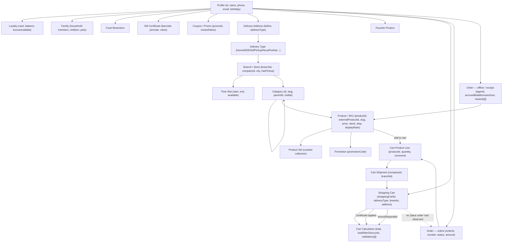

# 03 — Domain Model

Derived only from actual tool schemas and live read-only responses observed during this audit (see [00-live-validation-log.md](00-live-validation-log.md)). Fields shown are illustrative, not exhaustive.

## Object graph

## Key relationships and cardinality notes (observed, not assumed)

- **Profile → Cart**: 1:1 in practice. `silpo_get_my_shopping_cart` returns exactly one `shoppingCartId` (or `exists:false`) for the authenticated account — **no evidence of multiple named/concurrent carts** (e.g. no "office cart" vs "personal cart" distinction).
- **Cart → Shipment**: 1:many in schema (`shipments[]` array), but the live cart observed had exactly 1 shipment. Multi-shipment carts (e.g. split delivery) are schema-possible but unvalidated.
- **Branch → DeliveryType**: many:many, resolved per-coordinate by `silpo_get_available_delivery_types`. Live call at Kyiv coordinates returned 4 delivery types (`DeliveryHome`, `B2B`, `NovaPoshta`, `SelfPickup`), each with its own `branchId`.
- **Product identity is branch-scoped**: the same conceptual product can have a different `productId`/price/stock per `branchId` — all catalog reads require a branch context, confirming Silpo models availability as (branch × timeslot × SKU), not a global catalog.
- **Order (online) vs Receipt (offline)**: two structurally distinct history objects. Online orders have `status`, `delivery.timeSlot`, `discount`; offline receipts (in-store, loyalty-card-scanned) have `lagerId`, `accruedBalaBonusesSum`, `rewards[]`. Both are read-only history — **neither is writable and neither is a "recurring order" or "subscription" object** (see gaps doc).
- **Coupon/Promo ↔ Receipt reward**: `promoId` is the explicit join key connecting a coupon/promo definition to whether it actually paid out in a past offline order.
- **No company/tenant object anywhere.** `companyId` in the schemas is Silpo's own corporate/legal-entity identifier for a branch (all observed branches share `companyId: 1ec88c5d-a050-669c-8467-570a157f3e31`), **not** a customer-side business-account identifier. This is a critical distinction for the B2B use case — see [07-gaps-and-limitations.md](07-gaps-and-limitations.md).

## Entity presence checklist (from Phase 3 prompt)

| Candidate object | Exposed? | Evidence |
|---|---|---|
| User/profile | ✅ Yes | `silpo_get_my_profile` |
| Store/branch | ✅ Yes | `silpo_list_branches`, `branchId` throughout |
| Product/SKU | ✅ Yes | `silpo_get_products`, `silpo_find_products_batch` |
| Category | ✅ Yes | `silpo_get_categories`, `silpo_get_categories_tree` |
| Price | ✅ Yes | `product.price`, `oldPrice`, `specialPrices` fields |
| Availability/stock | ✅ Yes | `product.stock`, `available`, `silpo_get_replacements` (picking risk) |
| Promotion | ✅ Yes | `silpo_get_promotions`, `mustHavePromotion` filter |
| Coupon | ✅ Yes | `silpo_get_my_coupons`, `silpo_get_coupon_details` |
| Loyalty/bonus | ✅ Yes | `silpo_get_loyalty_info`, `cart.loyalty.bonusAvailable` |
| Cart | ✅ Yes | `silpo_get_my_shopping_cart` / `silpo_get_shopping_cart_by_id` |
| Cart item | ✅ Yes | `cart.shipments[].products[]` |
| Delivery / delivery type | ✅ Yes | `silpo_get_available_delivery_types` |
| Delivery address | ✅ Yes | `silpo_get_my_delivery_addresses`, `cart.address` |
| Delivery slot | ✅ Yes | `silpo_get_time_slots` |
| Order (online) | ✅ Yes, **read-only** | `silpo_get_my_online_orders` |
| Order status | ✅ Yes (as a history field only) | `order.status` (only value observed: `"received"`) |
| Order **creation/checkout** | ❌ **Not exposed** | No tool creates an order from a cart |
| Payment-related object | ⚠️ Partial | `cart.calculation.payment.availableTypes[]`, `paymentType` field exist, but no payment-execution tool |
| Certificate | ✅ Yes | `silpo_get_my_certificates`, `silpo_add_or_update_certificates` |
| Recommendation | ✅ Yes (product-level only) | `silpo_get_similar_products`, `silpo_get_replacements` |
| Search result | ✅ Yes | `silpo_find_products_batch` result envelope (`queries[]`, `totalFound`) |
| Family / household | ✅ Yes (consumer-only) | `silpo_get_my_family` |
| Food restriction | ✅ Yes (single-account scope) | `silpo_get_my_food_restrictions` |
| Company/organization/tenant | ❌ **Not exposed** | No schema field represents a customer-side company or membership |
| Employee/role | ❌ **Not exposed** | No schema field |
| Budget/spend limit | ❌ **Not exposed** | No schema field |
| Approval/workflow state | ❌ **Not exposed** | No schema field |
| Recurring order/subscription | ❌ **Not exposed** | No schema field (Premium "Плюхс" subscription is a Silpo loyalty product, not an order-recurrence mechanism) |
